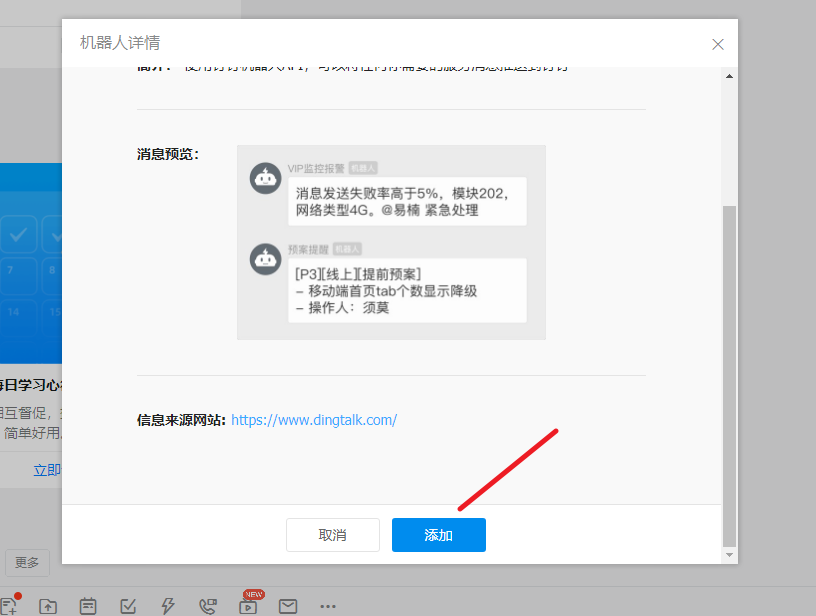
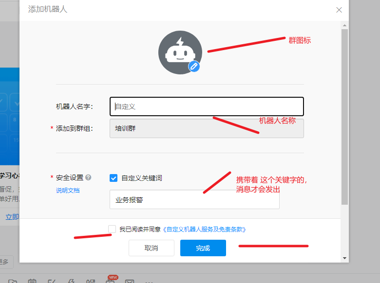

钉钉消息推送， 官方文档:   https://open.dingtalk.com/document/group/group-robot

我们采用

~~~~xml

<groupId>cn.snowheart</groupId>
<artifactId>spring-boot-dingtalk-robot-starter</artifactId>
<version>1.0.2.RELEASE</version>
~~~~

依赖， 可以快速的使用钉钉消息推送功能 。 对应的官方文档是:   https://gitee.com/snowheart/dingtalk-robot

# 钉钉群安装机器人

点击进入一个群, 选择智能群助手

选择 添加机器人:

点击 右边的设置

选择 自定义

点击添加:

完成之后，会生成一个相应 的 Webhook

https://oapi.dingtalk.com/robot/send?access_token=817edae9c662dc38bb5fcb4231f74b9e1eb9f33d17f1e12b25903980f82b7c9d

# Java代码，推送钉钉消息

## 添加依赖

在原先的项目上， pom.xml 文件上 添加依赖

~~~xml

<dependency>
    <groupId>cn.snowheart</groupId>
    <artifactId>spring-boot-dingtalk-robot-starter</artifactId>
    <version>1.0.2.RELEASE</version>
</dependency>
~~~

## 添加配置

application.yml 上添加配置， 只添加一个对应的 webhook 值即可。 webhook 是 群创建机器人的标识

~~~yml
dingtalk:
  robot:
    webhook: https://oapi.dingtalk.com/robot/send?access_token=817edae9c662dc38bb5fcb4231f74b9e1eb9f33d17f1e12b25903980f82b7c9d
~~~

## 功能测试

先注入客户端

@Autowired @Qualifier("dingTalkRobotClient")
private DingTalkRobotClient client;

### 普通文本通知

~~~java
@Test
public void testSendTextMessage()throws InterruptedException{
        DingTalkResponse response=null;

        response=client.sendTextMessage(new TextMessage("业务报警:构建 TextMessage对象发布!"));
        Assert.assertEquals(response.getErrcode().longValue(),0L);
        log.info(response.toString());
        Thread.sleep(3000);

        response=client.sendTextMessage("业务报警：构建普通字符串发布!");
        Assert.assertEquals(response.getErrcode().longValue(),0L);
        log.info(response.toString());
        Thread.sleep(3000);

        response=client.sendTextMessage("业务报警：通知指定人!",new String[]{"15734078927"});
        Assert.assertEquals(response.getErrcode().longValue(),0L);
        log.info(response.toString());
        Thread.sleep(3000);

        response=client.sendTextMessage("业务报警：通知群内所有人!",true);
        Assert.assertEquals(response.getErrcode().longValue(),0L);
        log.info(response.toString());
        Thread.sleep(3000);
        }
~~~

