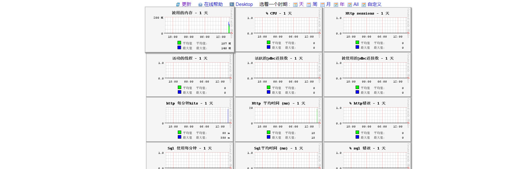

1. 添加依赖

~~~xml
 <!--添加 javamelody监控-->
        <dependency>
            <groupId>net.bull.javamelody</groupId>
            <artifactId>javamelody-spring-boot-starter</artifactId>
            <version>1.91.0</version>
        </dependency>
~~~

2. 配置文件中配置相应信息

~~~yaml
# javamelody 监控
javamelody:
  # 启用JavaMelody自动配置（可选，默认值：true）
  enabled: true
  # 要从监视中排除的数据源名称（可选，以逗号分隔）
  #  excluded-datasources: secretSource,topSecretSource
  # 启用对Spring服务和控制器的监视（可选，默认值：true）
  spring-monitoring-enabled: true
  # JavaMelody的初始化参数（可选）
  # See: https://github.com/javamelody/javamelody/wiki/UserGuide#6-optional-parameters
  init-parameters:
    # 记录http请求
    log: true
    # 从监视中排除图像，css，字体和js网址
    url-exclude-pattern: (/webjars/.*|/css/.*|/images/.*|/fonts/.*|/js/.*)
    # 汇总http请求中的数字
    #http-transform-pattern: \d+
    # 添加基本身份验证
    # authorized-users: admin:{SHA-256}6ca13d52ca70c883e0f0bb101e425a89e8624de51db2d2392593af6a84118090
    authorized-users: admin:abc123
    # 更改默认存储目录：
    #storage-directory: /tmp/javamelody
    # 更改默认的“ / monitoring”路径：
    #monitoring-path: /admin/performance
~~~

3. 按需在类上添加 @MonitoredWithSpring 注解， 如果不添加，表示所有方法都使用.

~~~js
@Service
@Slf4j
@MonitoredWithSpring
public class QrCodeServiceImpl implements QrCodeService {
	@Value("${qrcode.saveDir}")
	private String saveDir;
	
	@Value("${qrcode.parseDir}")
	private String parseDir;
	
~~~

4. 登录页面，展示信息
   